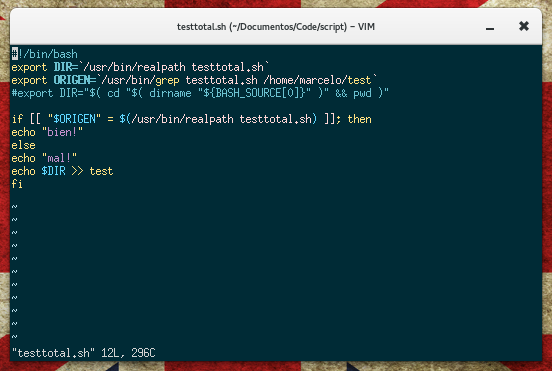

# Solarizedxterm

Solarizedxterm es una configuración de recursos X que aplica una paleta inspirada en Solarized a `xterm`, con una configuración simple de colores, tipografía, geometría y comportamiento visual.

## Características

- Configura una paleta de 16 colores para `xterm`.
- Define colores de fondo, primer plano y borde.
- Configura tipografía y tamaño.
- Desactiva la barra de desplazamiento.
- Define una geometría inicial de 88x24.

## Requisitos

- Un sistema con X11 y `xterm`.
- `xrdb` para cargar los recursos de X.
- La fuente `Bitstream Vera Serif Mono` si se quiere conservar exactamente la configuración incluida.

## Instalación

Cloná el repositorio y entrá al directorio:

```bash
git clone https://github.com/maniat1k/Solarizedxterm.git
cd Solarizedxterm
```

Copiá el archivo de configuración a tu directorio personal:

```bash
cp .Xdefaults ~/.Xdefaults
```

Cargá la configuración en la base de recursos de X:

```bash
xrdb -merge ~/.Xdefaults
```

Luego abrí una nueva instancia de `xterm`:

```bash
xterm
```

La nueva terminal debería utilizar la configuración definida en `.Xdefaults`.



## Personalización

Podés modificar colores, fuente, tamaño y geometría editando `~/.Xdefaults`. Después de cada cambio, volvé a cargar el archivo:

```bash
xrdb -merge ~/.Xdefaults
```

Para conocer todas las opciones disponibles, consultá la documentación oficial de xterm.

## Autor

Desarrollado por [Marcelo Lemos](https://github.com/maniat1k).

## Licencia

Este proyecto está distribuido bajo la [GNU General Public License v2.0](LICENSE).

[](https://ko-fi.com/marcelolemos)
